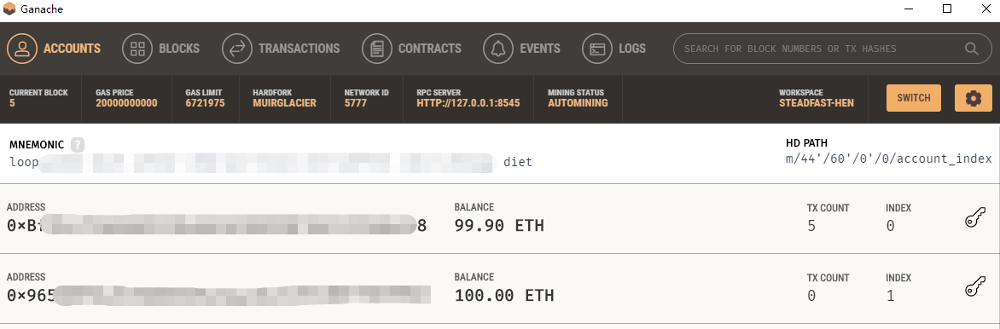
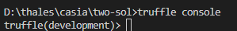
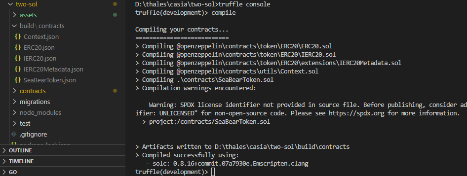
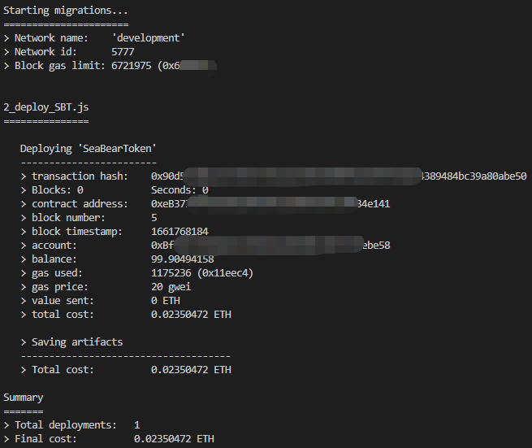
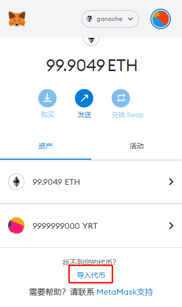
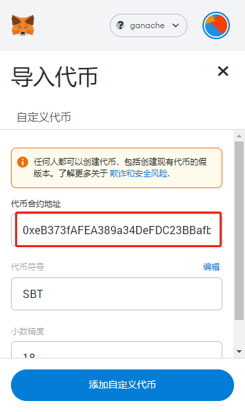

# truffle rookie


创建turffle智能合约


创建智能合约，本次创建一种货币叫海熊币(Sea bear token简称SBT)


## 前提


首先要启动ganache


可以使用软件界面版本


https://trufflesuite.com/ganache/


新建一个项目启动





> 也可以使用cli的脚手架版本，使用了界面版本软件的请无视这条
> ```
> npm i -g ganache-cli
> ```


## 依赖


项目启动之前需要先安装依赖


- 全局


需要 **truffle** 工具，如果没有安装需要全局安装


```bash
npm i -g truffle
```

- 项目


项目自身需要 **@openzeppelin/contracts** ，已经在package.json中存在，可以直接安装


```bash
npm i
```


## 部署合约


1. 进入console模式


执行下面的命令就会进入console模式


```bash
truffle console
```





2. 编译


经过第一步，现在已经是console模式了，可以执行truffle命令


```truffle
compile
```


编译之后，会在根目录下生成 **/build/contracts/\*.json** 





3. 部署


最后，部署可以得到相关信息


```
migrate
```





## 导入


打开**metamask**选择导入代币





刚才**truffle**执行**migrate**之后，有一项是**contract address**，把后面的值复制到**代币合约地址**，最后点击**添加自定义代币**即可完成合约





# 补充


这部分讲述如何新建合约


## 初始化


首先创建一个目录，然后初始化项目


> 这里包含truffle的初始化和npm的初始化


```
mkdir project
cd prject
npm init -y
truffle init
```

## 安装库


这里需要npm安装合约库


```
npm i -S @openzeppelin/contracts
```


## 修改配置


需要修改**truffle-config.js**中的配置


把**networks**中的**development**的注释打开


```js
networks: {
  ……
  development: {
    host: "127.0.0.1",     // Localhost (default: none)
    port: 8545,            // Standard Ethereum port (default: none)
    network_id: "*",       // Any network (default: none)
  },
  ……
}
```

## 创建合约


在**contacts**目录可以创建一个**\*.sol**文件的合约


比如本文创建的海熊币**SeaBearToken**


```sol
pragma solidity ^0.8.16;
import "@openzeppelin/contracts/token/ERC20/ERC20.sol";

contract SeaBearToken is ERC20 {
  constructor() ERC20("SeaBearToken","SBT") {
    _mint(msg.sender, 10000000000 * (10 ** uint256(decimals())));
  }
}
```


这里就用到了**npm**添加的库 **@openzeppelin/contracts**


> 具体内容可以看 https://docs.openzeppelin.com/contracts/4.x/erc20-supply


## 创建合约部署脚本


在**migrations**目录可以创建一个**\*.js**的脚本文件


比如本文创建的脚本


```js
const SeaBearToken = artifacts.require("SeaBearToken");

module.exports = function(deployer) {
  deployer.deploy(SeaBearToken);
}

```